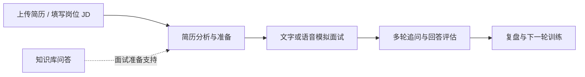

# Rehevo

> **Practice. Reflect. Evolve.**
> 面向求职者的 AI 求职训练平台：把一次练习变成可复盘、可改进、可重复的训练闭环。

Rehevo 不试图替代面试官，而是把简历准备、模拟面试、即时反馈、知识检索和复盘沉淀在同一条训练路径中。用户可以围绕目标岗位和 JD 反复练习，并依据每次会话的反馈规划下一轮训练。

## 训练闭环



## 能做什么

| 场景 | 能力 |
| --- | --- |
| 简历训练 | 上传 PDF、DOCX、DOC 或 TXT 简历，异步解析并生成结构化分析报告，支持导出。 |
| 文字模拟面试 | 根据岗位方向、难度、JD 与简历上下文出题，支持多轮追问与评估。 |
| 语音模拟面试 | 浏览器采集麦克风音频，提供实时 ASR 字幕、LLM 追问和 TTS 播报；回答由用户确认提交，避免把思考停顿误判为结束。 |
| 面试复盘 | 归档会话与评估结果，帮助定位下一轮练习重点。 |
| 知识库问答 | 上传文档后完成解析、分块与异步向量化，结合查询改写和阈值控制进行 RAG 问答。 |
| 模型配置 | 支持 DashScope、DeepSeek、Kimi、GLM、LM Studio 等 Provider；聊天、向量与语音模型可独立配置。 |

## 架构与工程实现

```text
浏览器（React + TypeScript）
          │ HTTP / WebSocket
          ▼
Spring Boot 4.1 + Spring AI 2.0
  ├── 简历、面试、语音、知识库、模型配置等业务模块
  ├── Redis Stream 异步任务与 Redisson 协调
  ├── PostgreSQL + pgvector 持久化与向量检索
  ├── RustFS / S3 文件存储，Apache Tika 文档解析
  └── Actuator、Prometheus 与 Grafana 可观测性配置
```

| 层级 | 技术 |
| --- | --- |
| 后端 | Java 21、Spring Boot 4.1、Spring AI 2.0、Gradle |
| 前端 | React 18、TypeScript、Vite、Tailwind CSS |
| 数据与异步 | PostgreSQL + pgvector、Redis、Redisson、Redis Stream |
| 文件与导出 | RustFS/S3、Apache Tika、iText |
| AI 与语音 | DashScope/OpenAI 兼容 API、Qwen ASR/TTS、WebSocket |
| 可观测性 | Spring Boot Actuator、Micrometer、Prometheus、Grafana |

## 快速启动（Windows）

### 前置条件

- JDK 21
- Docker Desktop
- Node.js 与 pnpm
- 至少一个可用的模型 Provider API Key（本地默认支持 DashScope）

复制 [`.env.example`](.env.example) 为 `.env`，填写必要配置。不要提交 `.env`、API Key 或运行时生成的 Provider 配置。

```dotenv
AI_BAILIAN_API_KEY=your_dashscope_api_key
APP_AI_CONFIG_ENCRYPTION_KEY=replace_with_a_stable_random_secret
```

也兼容已有的 Windows 用户环境变量 `ALI-API-KEY`。`APP_AI_CONFIG_ENCRYPTION_KEY` 应使用稳定的随机值，以确保加密后的模型配置可以在重启后继续读取。

### 一键启动

```powershell
scripts\start-local.cmd
```

脚本会启动或复用 RustFS、PostgreSQL、Redis，首次创建 `rehevo` 数据库及运行时配置目录，然后启动后端与前端。

| 服务 | 地址 |
| --- | --- |
| Web 前端 | `http://localhost:5173` |
| 后端健康检查 | `http://localhost:8080/actuator/health` |
| OpenAPI | `http://localhost:8080/swagger-ui.html` |
| RustFS 控制台 | `http://localhost:9001` |

首次使用 Rehevo 默认值时会创建 `rehevo` 数据库和对象存储 bucket；已有旧数据不会被删除。

### 手动启动

```powershell
docker compose -f docker-compose.dev.yml up -d
.\gradlew.bat :app:bootRun
```

```powershell
Set-Location frontend
pnpm install
pnpm run dev
```

## 验证

```powershell
.\gradlew.bat :app:test --no-daemon
```

```powershell
Set-Location frontend
pnpm run build
```

启动后，可先访问健康检查；再依次验证“简历上传 → 文字面试 → 知识库问答 → 语音会话”主路径。指标定义见 [METRICS_CONTRACT.md](METRICS_CONTRACT.md)，Prometheus、Grafana 与告警配置位于 [observability](observability)。

## 项目结构

```text
rehevo/
├── app/                    # Spring Boot 后端
│   ├── src/main/java/interview/guide/
│   │   ├── common/         # AI、异步、限流、异常与通用配置
│   │   ├── infrastructure/ # 文件、导出、Redis、映射
│   │   └── modules/        # 简历、面试、语音、知识库、模型配置
│   └── src/main/resources/ # 配置、Prompt、Skill 与脚本
├── frontend/               # React 前端
├── observability/          # Prometheus、Grafana、告警与基线实验
├── scripts/                # 本地启动脚本
├── docker-compose.dev.yml  # PostgreSQL、Redis、RustFS 开发依赖
└── docker-compose.yml      # 完整容器化部署
```

> Java 包名仍为 `interview.guide`。为避免品牌调整阶段产生大规模包迁移风险，当前保留该内部命名；它不影响 Rehevo 的产品名、构建产物或对外运行身份。

## 当前边界与路线图

- 这是一个可本地运行的训练平台；训练反馈用于辅助练习，不应代替真实招聘决策。
- 当前优先完善可验证的训练闭环、RAG 来源追溯与实时语音 Turn 协议，而不是扩展无关页面或堆叠新框架。
- 详细里程碑、验收门槛和不做事项见 [TODO.md](TODO.md)。

## License

本项目使用 [GNU Affero General Public License v3.0](LICENSE) 发布。
