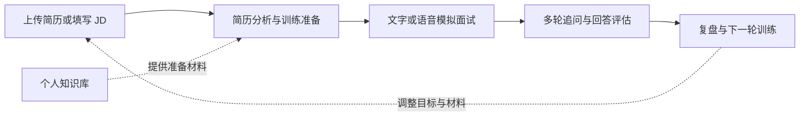
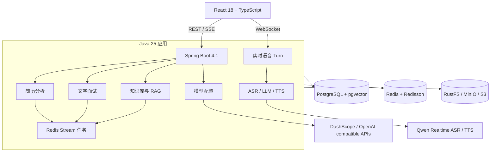

<h1 align="center">Rehevo</h1>

<p align="center"><strong>Practice. Reflect. Evolve.</strong></p>

<p align="center">
  面向求职者的 AI 求职训练平台：让每次练习都有上下文、有反馈，也能进入下一轮改进。
</p>

<p align="center">
  
  
  
  
  <a href="LICENSE"></a>
</p>

Rehevo 把简历分析、文字与语音模拟面试、知识库问答和训练复盘放在同一条路径中。用户可以围绕目标岗位、JD 和个人材料持续练习，系统则保留会话与评估结果，帮助下一轮训练建立在已有上下文之上。

> 当前版本面向本地运行和自托管体验。AI 反馈用于辅助训练，不应代替真实招聘决策。

## 为什么是 Rehevo

- **不是一次性问答。** 简历、JD、面试过程和评估结果共同构成训练上下文。
- **不把停顿误判为回答结束。** 语音面试将实时字幕、回答提交、追问和语音播放拆成明确的 Turn 协议。
- **不让高耗时 AI 调用阻塞主请求。** 简历分析、知识库向量化和面试评估通过 Redis Stream 异步执行，并处理重试与 Pending 消息恢复。
- **不把模型输出当成天然可靠的 JSON。** 统一结构化调用封装 Schema 校验、修复型重试和调用指标，供多个业务模块复用。

## 训练闭环



## 核心能力

| 场景 | 当前能力 |
| --- | --- |
| 简历分析 | 上传 PDF、DOC、DOCX 或 TXT，异步解析并生成结构化分析报告，支持历史记录、重新分析和 PDF 导出。 |
| 文字模拟面试 | 结合岗位方向、难度、JD、简历和内置 Skill 生成问题，支持追问、回答评估、会话恢复和报告导出。 |
| 实时语音面试 | 浏览器采集音频，经 WebSocket 串联实时 ASR 字幕、LLM 追问和分段 TTS；支持暂停、恢复、上下文压缩和异步评估。 |
| 知识库 RAG | 文档解析、分块、异步向量化与流式问答；根据问题长度动态调整 TopK 和阈值，并在多轮对话中执行查询改写。 |
| 知识库面试 | 基于指定知识库异步生成题目，支持分类、难度、追问和独立训练会话。 |
| 面试管理 | 维护面试计划、日历和历史统计，将练习安排与实际求职进度放在同一工作区。 |
| 模型配置 | 管理聊天、Embedding、ASR 与 TTS 配置；支持 DashScope 及多种 OpenAI 兼容 Provider。 |

## 工程实现

### 实时语音 Turn

语音链路不是简单的“录音后请求模型”：前端持续发送 PCM，后端转发实时字幕并聚合多个 STT 片段；回答满足静音与长度条件后才提交给 LLM，随后按句切分并发合成 TTS。会话暂停、异常断开、ASR 重连和评估恢复都有独立状态处理。

### 可恢复异步任务

Redis Stream 的通用 Producer/Consumer 模板负责消费组初始化、任务领取、有限重试、ACK 和 Pending 消息重新认领。简历分析、知识库向量化、题目生成及面试评估复用同一套运行语义，业务模块只实现自己的状态迁移和处理逻辑。

### 结构化模型调用

`StructuredOutputInvoker` 统一处理 Bean Schema 校验、严格 JSON 指令、错误反馈重试、本地引号修复和 Micrometer 指标，避免各业务 Service 重复实现模型输出解析与重试。

### 可配置 RAG

知识库问答基于 PostgreSQL 与 pgvector。系统结合对话历史改写问题，并按问题长度选择不同的 TopK 和最小相似度；改写失败时回退原问题，无有效命中时返回固定的知识边界提示。

## 系统架构



| 层级 | 技术 |
| --- | --- |
| 后端 | Java 25、Spring Boot 4.1、Spring AI 2.0、Gradle |
| 前端 | React 18、TypeScript、Vite、Tailwind CSS 4 |
| 数据与检索 | PostgreSQL 16、pgvector、Flyway |
| 缓存与异步 | Redis、Redisson、Redis Stream |
| 文件与导出 | RustFS/MinIO/S3、Apache Tika、iText 8 |
| AI 与语音 | OpenAI 兼容 API、Qwen Realtime ASR/TTS、WebSocket |
| 可观测性 | Actuator、Micrometer、Prometheus Endpoint |

## 快速开始

### 方式一：Docker Compose 完整启动

适合快速体验。只需要 Git、Docker Desktop 和一个可用的 DashScope API Key。

```powershell
git clone https://github.com/kt-surge/rehevo.git
Set-Location rehevo
Copy-Item .env.example .env
```

Linux 或 macOS 使用：

```bash
git clone https://github.com/kt-surge/rehevo.git
cd rehevo
cp .env.example .env
```

至少修改 `.env` 中的两个配置：

```dotenv
AI_BAILIAN_API_KEY=your_dashscope_api_key
APP_AI_CONFIG_ENCRYPTION_KEY=replace_with_a_stable_random_secret
```

不要提交 `.env`、API Key 或运行时生成的 Provider 配置。加密密钥在同一环境中应保持稳定，否则重启后将无法读取已加密的模型配置。

```bash
docker compose up -d --build
```

| 服务 | 地址 |
| --- | --- |
| Rehevo | <http://localhost> |
| 后端健康检查 | <http://localhost:8080/actuator/health> |
| Swagger UI | <http://localhost:8080/swagger-ui.html> |
| MinIO 控制台 | <http://localhost:9001> |

查看后端日志或停止服务：

```bash
docker compose logs -f app
docker compose down
```

### 方式二：本地源码开发

适合调试后端与前端。需要 JDK 25、Node.js 20+、pnpm 10+ 和 Docker Desktop。

先启动 PostgreSQL、Redis 与 RustFS：

```bash
docker compose -f docker-compose.dev.yml up -d
```

启动后端：

```powershell
.\gradlew.bat :app:bootRun
```

Linux 或 macOS 使用：

```bash
./gradlew :app:bootRun
```

另开终端启动前端：

```bash
cd frontend
pnpm install --frozen-lockfile
pnpm run dev
```

开发模式前端地址为 <http://localhost:5173>。更完整的 Provider 配置说明见 [SETUP_API_KEYS.md](SETUP_API_KEYS.md)。

## 模型与配置边界

- DashScope 是默认聊天和 Embedding Provider，也是当前实时 ASR/TTS 的实现来源。
- Kimi、DeepSeek、GLM、LM Studio 及其他 OpenAI 兼容服务可作为聊天 Provider；是否支持 Embedding 由 Provider 配置单独声明。
- pgvector 当前使用 1024 维向量和余弦距离。切换 Embedding 模型时必须同步确认维度与已有向量数据。
- 真实模型调用可能产生费用；建议先使用小文档和短会话验证配置。

## 验证

后端测试：

```powershell
.\gradlew.bat :app:test --no-daemon
```

```bash
./gradlew :app:test --no-daemon
```

前端类型检查与生产构建：

```bash
cd frontend
pnpm install --frozen-lockfile
pnpm run build
```

语音 E2E 需要已启动的前后端、可用的模型凭证以及浏览器麦克风权限：

```bash
cd frontend
pnpm run test:e2e
```

## 项目结构

```text
rehevo/
├── app/
│   ├── src/main/java/interview/guide/
│   │   ├── common/          # AI、异步、限流、异常与通用配置
│   │   ├── infrastructure/  # 文件、Redis、对象映射等基础设施
│   │   └── modules/         # 简历、面试、语音、知识库与模型配置
│   └── src/main/resources/  # 配置、Prompt、Skill、迁移与脚本
├── frontend/                # React 页面、组件与 API Client
├── docs/                    # 语音架构与测试记录
├── docker/                  # 数据库初始化文件
├── docker-compose.dev.yml   # 本地开发依赖：PostgreSQL、Redis、RustFS
└── docker-compose.yml       # 前后端及依赖的完整容器编排
```

Java 内部包名仍为 `interview.guide`。为避免品牌调整引发无收益的大规模包迁移，当前保留该命名；它不影响 Rehevo 的产品名和运行方式。

## 延伸阅读

- [模型与 API Key 配置](SETUP_API_KEYS.md)
- [实时语音面试架构](docs/voice-interview-architecture.md)
- [语音面试 E2E 测试记录](docs/testing/voice-interview-e2e.tdd.md)
- [TTS WebSocket 握手测试记录](docs/testing/voice-tts-handshake.tdd.md)
- [文档解析测试说明](app/src/test/java/interview/guide/infrastructure/file/README.md)

## 使用边界

- 当前默认配置适合本地开发和个人训练；公开部署前需要补充身份认证、HTTPS、密钥管理、备份与访问控制。
- 模型生成内容可能存在遗漏或错误，训练报告应与岗位要求和人工判断结合使用。
- 上传的简历和知识库文件会进入本地数据库与对象存储，请按实际部署环境制定数据保留与删除策略。

## 致谢与许可证

Rehevo 基于开源项目 [JavaGuide / interview-guide](https://github.com/Snailclimb/interview-guide) 进行持续扩展与重构。

本项目使用 [GNU Affero General Public License v3.0](LICENSE) 发布。欢迎通过 Issue 或 Pull Request 参与改进。
